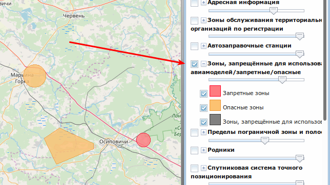

<https://drones.me2.ru/> - сборник информации "из первых рук" о правилах полётов на дронах в разных странах, [в России](#россия-) и [Беларуси](#беларусь-) _(приветствуется помощь по Украине)_

Автор не несёт ответственности за неточности, но старается их фиксировать и исправлять как можно быстрее.

Если вы заметили неточность или ошибку в сведениях, [заведите багу](https://github.com/leipreachan/drone-rules-in-russian/issues) или оформите [pull request](https://github.com/leipreachan/drone-rules-in-russian/pulls) или [прокомментируйте через виджет Telegram](https://drones.me2.ru/#комментарии) в самом низу этой страницы.

* TOC
{:toc}

# Барбадос 🇧🇧

Полёты и импорт дронов разрешены строго при наличии разрешения, без разрешения - [конфискация дрона в аэропорту](https://gisbarbados.gov.bb/blog/one-year-ban-on-importation-of-drones/).  

Туристу можно попытаться оформить разрешени, но это может занять **очень** продолжительное время (примерно три-четыре месяца): <http://www.telecoms.gov.bb/website/index.php?option=com_content&view=article&id=95:drones-how-to-apply-for-a-temporary-exemption&catid=8:pages>

# Беларусь 🇧🇾

**Официальная информация ввоз-вывоз**

Т.к. квадрокоптеры могут относиться к беспилотным летательным аппаратам, включенным в перечень товаров и технологий двойного назначения, которые могут быть применены при создании вооружений и военной техники и подлежат экспортному контролю, то беларуская таможня требует для безпроблемного перемещения квадрокоптера через границу получить два документа:

1. заключение Госкомвоенпрома, 
2. разрешение РУП «БелГИЭ».

При пересечении границы необходимо проследовать по «красному» коридору, заполнить и представить должностному лицу таможни пассажирскую таможенную декларацию и документы, на основании которых была заполнена декларация (заключение Госкомвоенпрома, разрешение РУП «БелГИЭ»). 

**Практика ввоз-вывоз**

Прецеденты есть когда у граждан РБ изымали коптеры и отдавали на экспертизу для установления. Граждан РБ могут досматривать особенно тщательно, т.к. при выезде-въезде чаще, чем раз в три месяца, стоимостная и весовая норма отнесения перемещаемого товара к товару для личного пользования, и, соответственно, его беспошлинного ввоза составляет 300 евро и 20 кг. Вероятность проверки багажа у беларусов большая. Про изъятие коптеров у иностранцев не слышал. 

**Официальная информация полеты и аэрофотосъемка**

Квадрокоптеры массой до 0,5 кг можно запускать в любом месте (кроме запретных зон) на высоту до 100 метров. В случае аэрофотосъемки необходимо согласование с Минобороны. В случае полетов выше 100 метров и в запретных зонах необходимо согласование Минобороны.
Квадрокоптеры массой более 0,5 кг можно запускать (в том числе и в запретных зонах) после согласования с Минобороны.

Весь отснятый материал необходимо предоставить В минобороны для экспертизы. Использование материала разрешается после получения соответсвтующего акта Минобороны.

Осуществление аэрофотосъемки без разрешения Генштаба не влечет за собой административную ответственность, но есть объекты, информация о которых не подлежит разглашению и которые вы можете снять по неведению. Необходимость получения разрешения Генштаба предохраняет вас от более тяжелых видов ответственности, вплоть до уголовной.

**Практика полеты и аэрофотосъемка**

При «аккуратном» использовании проблем быть не должно. Пока есть один случай штрафа – полёт был над БелАЭС (закрытая зона для полетов).

### NFZ в Беларуси

На сайте публичной кадастровой карты <http://map.nca.by/map.html> надо выбрать "Зоны, запрещённые для использования авиамоделей/запретные/опасные": 

# Великобритания (она же Англия) 🇬🇧

* Не летать выше 122 метров
* Не ближе 150 метров к скоплениям людей больше тысячи человек и не ближе 50 метров от транспортных средств, зданий, яхт и т.п. не в управлении пилота
* Не летать ближе пяти километров от границ зон аэропортов
* Дрон должен быть в пределах прямой видимости
* Кроме NFZ зон запреты на полёты действуют в Areas of National Beauty (т.е. заповедниках), а так же на территориях, принадлежащих National Trust и English Heritage (это большие замки и прочие предметы культурного наследия). 

Правила любительских полётов: <https://dronesafe.uk>

# Венгрия 🇭🇺

1. Для полётов требуется подать заявление не менее чем за 30 дней до полёта. Заявку требуется оплатить переводом, стоимость заявки около 3000 форинтов. [Форму заявления можно скачать тут](http://www.nkh.gov.hu/documents/11106/0/NOTIFICATION+FORM+OF+THE+OPERATION+WITH+REMOTELY+PILOTED+AIRCRAFT+SYSTEM.pdf). Подача по электронной почте [rpas@nfm.gov.hu](mailto:rpas@nfm.gov.hu) или по телефону  `+ 36/1 / 474-12-74`. В заявлении должны быть указаны:
   * Имя, адрес и телефон пилота
   * Координаты полёта (например, 200 m radius centered at coord point 47°24’49″N 18°45’56″E)
   * Верхнюю и нижнюю границу пространства полёта (например, GND-1500’ AMSL)
   * Дату полёта в формате, принятомы в Венгрии (YYYY.MM.DD.) и время в UTC (например, 2017. Július 20. – 2017. Július 29. SR-SS)
   * Причина: `operation of unamnned aircraft` (полёт беспилотного летательного аппарата)
   * Имя и телефон лица, ответственного за координацию с воздушным трафиком (имя пилота)
   * Имя и телефон лица, подающего заявление
2. Кроме разрешения крайне рекомендуется застраховать дрон
3. При **вылете** из Будапешта дрон могут потребовать сдавать дрон в обычный багаж. С дроном в ручной клади большая вероятность не пройти досмотр.

В остальном правила аналогичны обычным европейским.

# Вьетнам 🇻🇳

Ввоз квадрокоптеров на территорию Вьетнама запрещен. По прилете в аэропорт квадрокоптеры изымаются и могут быть возвращены при вылете с условием оплаты стоимости камеры хранения за дни пребывания в стране.

# Германия 🇩🇪

1. Требуется страховка
2. На дрон следует прикрепить табличку из несгораемого материала, на которой должен быть указан контактный телефон
3. Максимальная высота полёта 150 м
4. Запрещены полёты над:
   * государственными учреждениями
   * строениями федерального и регионального значения
   * аэропортами
   * городской застройкой
   * над множеством людей (концерты, толпы и т.п.)
   * госпиталями
   * зонами под контролем полиции, военных или спасательных операций
   
# Грузия 🇬🇪

Полёты дронов разрешены за исключением стандартных ограничений (вблизи аэропортов, скоплений людей и т.п. - запрет).
   
# Египет 🇪🇬

Ввоз дронов запрещён. В лучшем случае у вас его изымут на таможне.

# Италия 🇮🇹

Как минимум, запрещены полёты в Риме, Венеции. Штраф 5000 евро + конфискация дрона.

За пределами городов летать можно с соблюдением европейских правил.

# Испания 🇪🇸

* Запрещены полёты ближе 150 метров к строениям, а так же полёты над скоплениями людей и т.п. Это означает, что в городах полёты фактически запрещены тоже.

### NFZ в Испании

<https://drones.enaire.es/> (есть некоторые отличия от DJI NFZ)

# Куба 🇨🇺

Ввоз дронов запрещён, но (!) вы можете оставить его на таможне за отдельную плату и получить его когда будете вылетать. 

# Латвия 🇱🇻

* На дрон должны быть нанесены идентификационные данные (телефон пилота)
* Пилот дрона обязательно должен быть одет в специальный жилет
* Запрещены полёты над зданиями, мостами, шоссе и скоплениями людей. Фактически, для полётов в городах и национальных пархах требуется разрешение
* В Риге тестируются DJI-ные устройства идентификации (и нахождения) пилота. Штраф за несогласованные полёты до 3000 евро

Правила полётов в Латвии: <http://www.caa.lv/en/civil-aviation/about-caa/what-s-new/pilot-the-drones-safely-and-legally.html> и <http://www.caa.lv/upload/userfiles/files/buklets-lv-v1_83(1).pdf>

### NFZ в Латвии

<http://nofly.lv> (кажется, временно недоступен)

# Норвегия 🇳🇴

* Летать только в пределах прямой видимости,  в светлое время суток и при хорошей погоде
* Не летать над людьми
* Не летать выше 120 метров
* Не летать ближе 150 метров от зданий, транспорта, не летать над военными, правительственными объектами и в запретных зонах
* Не летать ближе 5 км от аэропортов

Правила любительских полётов: <https://luftfartstilsynet.no/en/drones/Drones_for_leisure/droneguide/> 

# Россия 🇷🇺

В России полёт на дроне в большинсте мест требует получения разрешения. 

[Инструкция по тому, как "разблокировать" небо](/official_uav_flight_in_russia/)

Упрощённые правила действуют в Татарстане: <https://pilotuav.ru>

# США 🇺🇸

1. Требуется регистрация в FAA (5$) <https://www.faa.gov/uas/>
2. На дрон требуется нанести номер регистрации
3. Максимальная высота 400 футов (121 метр)
4. Полёты в национальных парках запрещены, штрафы очень высокие.

# Тунис 🇹🇳

Дрон конфискуют при прилёте, если у вас нет специального разрешения. Получить разрешение официально очень сложно, т.к. оно должно пройти через Министерство Обороны, Министерство Внутренних Дел, Министерство Жилья и Департамент транспорта. Пишут, что получение разрешения занимает невероятное количество времени и всего несколько человек умудрились его сделать. Законодательство не обновлялось с 1995 года и улучшений в этом плане пока не предвидится

# Турция 🇹🇷

В целом, полёты разрешены. До июля 2018го года действовали более строгие правила. Сейчас они примерно такие:

* Не летать над скоплениями людей
* Не летать выше 120 метров
* Только днём
* Не летать рядом с аэропортами, заповедниками и военными объектами

Для полётов дронов весом больше 500 грамм требуется обязательная регистрация: <https://iha.shgm.gov.tr/public/formlar>. 

Некоторые авиалинии полностью забанили перевозку дронов в Турцию, поэтому имеет смысл это проверять заранее.

Список правил на турецком языке: <http://web.shgm.gov.tr/doc5/sht-iha.pdf>

# Узбекистан 🇺🇿

* Полёты запрещены, введена уголовная ответственность (от трёх до 10 лет) за _незаконный_ ввоз и использование дронов
* Для получения исключительного разрешения ввоза и полётов требуется разрешение Кабинета Министров страны (в теории можно получить для съёмки роликов о туризме)
* <https://www.gazeta.uz/ru/2019/02/28/drone/>

# Финляндия 🇫🇮

В целом, правила очень лояльные.

* Не летать над скоплениями людей (не ближе 50 метров)
* Не летать выше 150 метров
* Не летать рядом с аэропортами (ближе 1 километра нужны разрешения), заповедниками и военными объектами
* Поддерживать визуальный контакт с дроном

### NFZ в Финляндии

<https://aviamaps.com/map?drone#4.23/65.35/26.1>

# Франция 🇫🇷

Вкратце, во Франции запрещены полёты над Парижем и в пределах ряда зон, не обозначенных на картах DJI. В остальных местах летать можно.

1. Максимальная высота полёта 150 м
2. Запрещены полёты над:
   * государственными учреждениями
   * строениями федерального и регионального значения
   * аэропортами
   * городской застройкой
   * над множеством людей (концерты, толпы и т.п.)
   * госпиталями
   * зонами под контролем полиции, военных или спасательных операций

### NFZ во Франции

<http://www.developpement-durable.gouv.fr/quelle-place-drones-dans-ciel-francais>

# Эстония 🇪🇪

* Специального разрешения не требуется для полётов в обычных зонах
* Для полётов в "особых" зонах [требуется подать разрешение не менее чем за три дня](https://www.ecaa.ee/en/how-operate-uadrone), стоимость 45 евро
* Перед полётами обязательно надо убедиться, что на сайте агентства по аэронавтике нет новости про закрытые зоны: <https://www.ecaa.ee/et/uudised?subject[0]=176>

Правила полётов: <https://www.ecaa.ee/en/news/how-operate-ua>

# Полезные ссылки

* Список NFZ от DJI: <https://www.dji.com/uk/flysafe/geo-map>
* Страховка для дронов: <https://www.fpvuk.org>
* Англоязычный ресурс с правилами полётов: <https://uavcoach.com/>

# Комментарии

