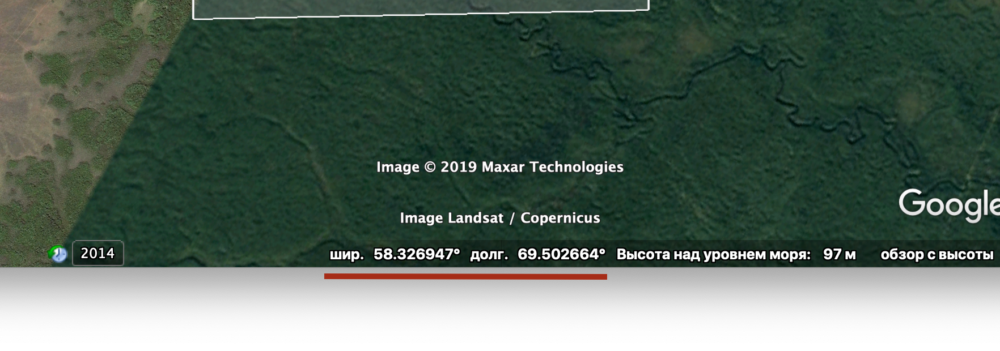

# Как перекрыть небо для полётов на беспилотнике

## План
1. Посмотреть какой ОрВД (Центр организации воздушного движения) ответственный в вашей зоне полёта
2. Позвонить в ОрВД, узнать на кого и куда писать Представление о полёте (Заявка на получение разрешения)
    1. Написать в Администрацию города\района, ФСБ, ФСО если требуется.
3. Составить Представление и послать его в ОрВД.
    1. Прикрепить ответы от Администрации города\района, ФСБ, ФСО. Если имеются.
4. Позвонить в ОрВД через 15 минут - 2 часа, узнать номер режима (Номер вашей заявки на полёт).
5. Узнать у ОрВД:
    1. Кого требуется уведомить о полёте?
    2. Кому отослать План полёта?
6. Составить план полёта.
7. Не позднее чем за 24 часа отправить план полёта тем, кого назвал ОрВД.
8. За 2 часа до полёта, позвонить тем, кого назвал ОрВД и сказать, что режим Номер ХХХХХ будет летать через 2 часа.
    1. Если отказываемся от полёта, обязательно позвонить в ОрВД или кому он скажет и отменить режим на этот день. (это важно)
9. Перед полётом позвонить тем, кому сказал ОрВД и уведомить о начале полёта. 
10. После окончания полёта, позвонить тем, кому сказал ОрВД и отчитаться об окончании полёта (снятие режима)

## Базовая терминология

**ОрВД** - Центр Организации Воздушного Движения. Их несколько

**Представление** - официальное письмо в ОрВД, с которого начинается разрешение о полёте. На выходе получаем Местный Режим

**Местный режим** - Официальный номер полёта. Может быть выдан на 3 основных дня и 3 резервных максимум. Обычно номер такой же, как у борта беспилотника.

**Номер борта** - Номер конкретного беспилотника. 5 цифр. Можно придумать отбалды. Можно зарегистрировать беспилотниц официально.

**ЗЦ** - Зональный Центр ОрВД. Один из нескольких сегментов РФ по Организации воздушного движения. Туда-то мы и пишем

**ГЦ** - Главный Центр. Иерархически, самый высший орган управления воздушным движением. Ниже него Зональные Центры.

**План полёта, ПП** - Специально составленный, машиночитаемый документ, который содержит в себе все данные о полёте, пилоте, борте, координатах и высотах. А так же время старта и время лётной смены.

**Время лётной смены** - Планируемое время, сколько Борт будет в воздухе. Отсчёт со времени взлёта. Указывается 4мя цифрами. 0600 - 6 часов. (Подробнее в разделе План полёта)

## Узнаем ваш ОрВД

Буду показывать на рандомной зоне около Тюмени.

Лезем на сайт [ОрВД](http://www.gkovd.ru/filialy/) и находим там свой Зональный Центр. Именно туда мы будем писать. На сайте есть телефоны, почта (почту можно и нужно уточнить по телефону)

Надо им позвонить и узнать на чьё имя писать Представление. А так же на какую почту.

## Представление. Подготовка

Для представления нам надо провести некоторую подготовительную работу.

Качаем [kml](AA_RF.kmz) файл и подгружаем его в Google Earth Pro. Включаем отображение нужных нам зон. Да, это актуальная информация по РФ всех зон, полётов, воздушных трасс, ответственных центров и зональных центров. А так же всех местных аэропортов. Теперь-то можно понять какой пидорас летает над моей дачей когда я сплю.

В настройках включаем "Градусы с десятичными долями"

Теперь определяемся где мы летаем. Для полётов нужнен или маршрут, или полигон. Мы будем делать полигон. 

Полигон отмечается так, чтоб он был закрывающий. Сейчас объясню. Представьте, что наш полигон имеет 4 точки (прямоугольник). Координаты точек предоставляются в градусах **000002С0000001В** (2 градуса Север. 1 градус Восток). Координаты нашего вымышленного прямоугольника будут к примеру **000002С0000002В 000002С0000001В 000001С0000001В 000002С0000001В** (отсчёт по точкам по часовой стрелки от левой верхней точки полигона). Но так указать нельзя. Завершающей точкой полигона обязана быть та же точка, что и начинающая. То есть у нас получается **000002С0000002В 000002С0000001В 000001С0000001В 000002С0000001В 000002С0000002В**.

Теперь как узнать реальные координаты? Тут всё просто, у нас есть Google Earth. Если в одном из прошлых шагов вы включили в настройках отображение "Градусы с десятичными долями", то снизу, при наведении мышкой, получите координаты. 

Тут важный момент, в первой части координаты (в той что до буквы С) у нас *6* (**000002**С0000002В) цифр, во второй - семь (000002С**0000002**В), то есть если цифр не хватает, и вторая координата у вас из Google Earth например **69.977578**, то нужно указать **0699775** (основной градус **69** с нулём подразумевает что может быть до 180 (**069**9775). И дробная часть 4 цифры (069**9775**)) Можно не особо точно в дробной части, например две последние цифры можно взять 00. (**0699700**)

Итак, мы нашли координаты нашей зоны и составили строку с полигоном. В нашем примере около Тюмени это будет **"583490С0694610В 583540С0694730В 583490С0694810В 583420С0694720В 583490С0694610В"**.

## Представление. Пишем.

Приступаем к составлению Представления. Открываем Ворд или другой адекватный текстовый редактор.

### В шапке пишем:
**Если вы Юрлицо, то на бланке компании.
Если физлицо, то пишем что-то вроде этого**

От 
Своё ФИО,
Адрес,
Телефон,
Электронную почту.

**Далее ниже**: Начальнику Тюменского ЗЦ Чувакову Чуваку Чуваковичу.

**По центру листа название:** Представление на установление местного режима на 18,19,20 сентября 2019г. - основные дни; 24,25,26 сентября 2019г. - резервные дни.

**Теперь тело документа:**
Прошу Вас установить МР для обеспечения безопасности полетов при выполнении полетов БВС: тип «DJI Mavic Air», борт № 93728 в районе деревни Дубровное вблизи города Тобольска.

Зона 583490С0694610В 583540С0694730В 583490С0694810В 583420С0694720В 583490С0694610В. 

Диапазон используемых высот: абсолютная высота полета (AMSL) от 000м до 600 м (H(ист.)=0-550 м). **(Высота только абсолютная от уровня моря, Google Earth показывает. Прибавьте к ней высоту полёта + ещё метров 50 на всякий)** 

Время полетов: 05.00 до 11.00 (UTC). **(Время только в UTC!)**

Границы района полетов, диапазон используемых высот даны с учетом максимальных отклонений от расчетных траекторий полета и максимальной высоты рельефа местности.

Полеты над населенными пунктами не выполняются.**(Пишем только если это так, иначе указываем населенные пункты и они тогда потребуют согласия от администраций)**

Ограничений для взлетов и посадок на аэродромах не устанавливается.**(Пишем если летаем в 30км от аэропортов или вне зон действия аэропортов)**

Цель: мониторинг размножения ёжиков в условиях сибирских пожаров.

Обеспечение полетов БВС, взаимодействие с органами ОВД осуществляет **Тут ваше ФИО и номер телефона**

Связь с:

**И перечисляем ФИО, телефоны и зону ответственности людей. Возможно тут придётся указать какие местные филиалы ОрВД участвуют в обмене информацией. В нашем случае наши же ФИО**

**Ниже ставим линию для подписи и вашу фамилию.** 

**Печатаем, подписываем, сканируем, отправляем в ОрВД**

## Местный режим

Если всё верно, то вы увидите в Google Earth красную зону ваших полётов. Это будет значить что всё прошло и вы теперь в базе. Я советую не ждать два часа, а позвонить им на всякий пожарный через пол часа после отправки представления и узнать всё ли хорошо.

Если что-то не так, то они могут сами перезвонить и сказать, к примеру, что рядом аэропорт и нужно послать представление в ГЦ. Так же они скажут телефоны и почты.

После того как вас добавили, всё равно нужно им позвонить и узнать:
1. Номер режима. Обычно это номер борта, в нашем случае 93728
2. Кого предупреждать и уведомлять. 

Вы прекрасны. Теперь Ваш местный режим активен и с этого момента начинается ваша ответственность.

Если вдруг вы не можете или не будете летать в любой из отмеченных дней, нужно Позвонить в ОрВД и отменить Местный Режим на нужные даты.

